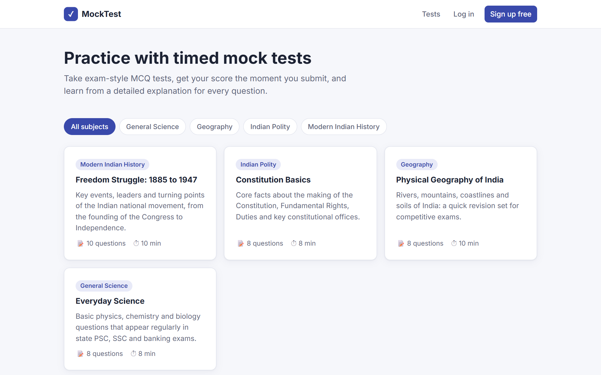
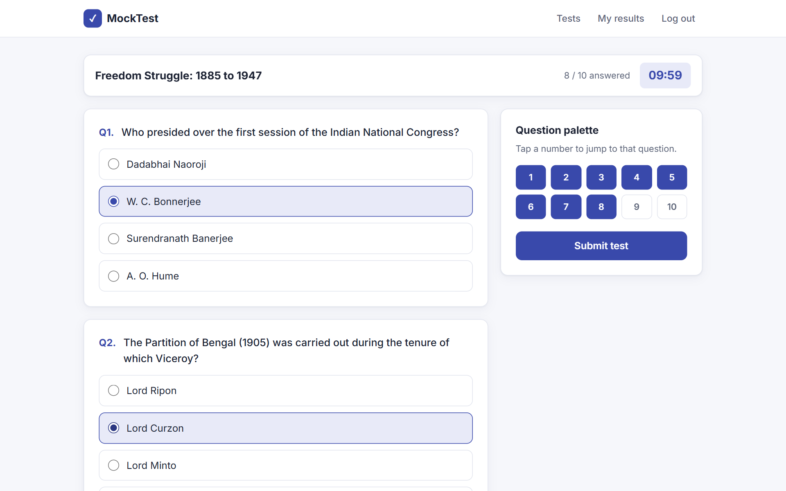
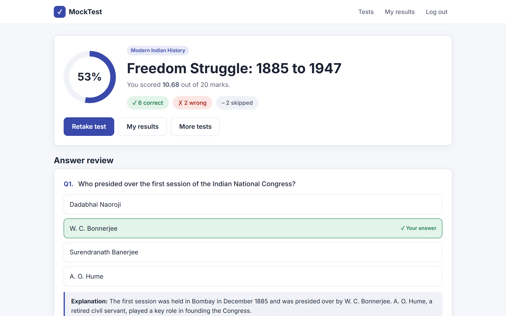
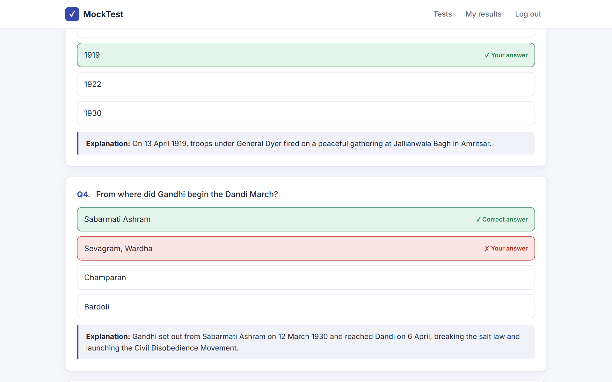
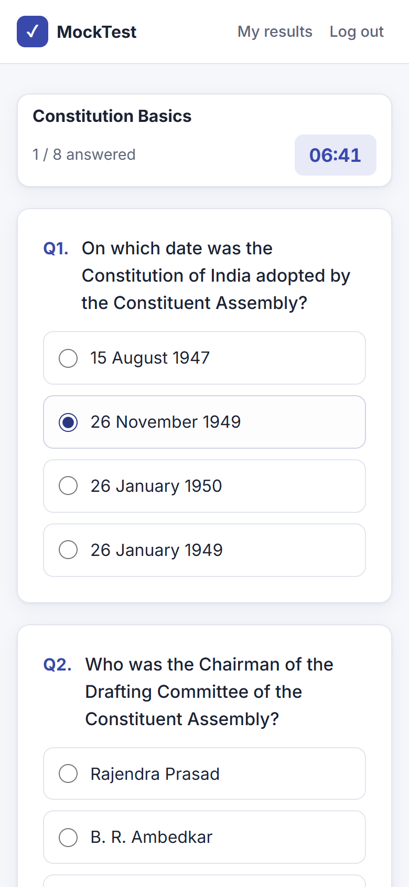
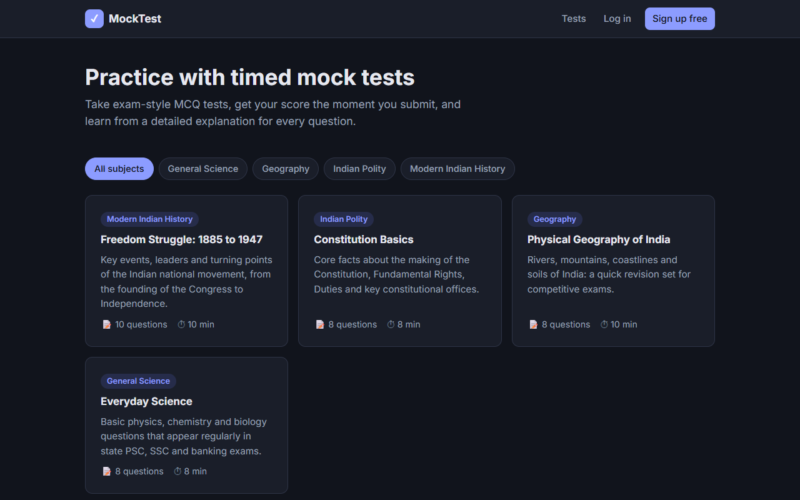

# Mock Test Platform

An online mock test platform for coaching institutes, tutors and exam-prep websites. Students take timed MCQ tests, get their score the moment they submit, and review every question with an explanation. The institute manages tests, questions and results from an admin panel, with no coding needed.

**Live demo:** _coming soon_ · Demo login: `demo` / `demo12345`



## Features

**For students**
- Timed tests with a live countdown that auto-submits when time runs out
- Question palette to jump between questions and see what's answered
- Instant results: score, percentage, and correct / wrong / skipped counts
- Answer review that shows the right answer and an explanation for every question
- Personal dashboard with attempt history, average and best scores
- Answers are kept if the page is refreshed by accident
- Works on mobile, with automatic dark mode

**For the institute (admin panel)**
- Create subjects and tests, and add questions with 2 to 6 options each
- Set duration, marks per question and **negative marking** (e.g. UPSC-style −0.66)
- Publish or unpublish tests with one click
- See every student attempt and score
- Validation stops a question being saved without exactly one correct answer

**Fair and secure by design**
- The timer is enforced on the server, so turning off JavaScript or editing the page doesn't buy extra time
- Answers are checked against the test they belong to, so a tampered form can't score points
- A submitted test can't be submitted again to change the score
- Students can only see their own attempts
- Top-scorer leaderboard on each test

## Screenshots

| Taking a test | Result |
|---|---|
|  |  |

| Answer review | Mobile | Dark mode |
|---|---|---|
|  |  |  |

## Tech stack

- **Backend:** Python 3.12, Django 5.2 (LTS)
- **Database:** PostgreSQL in production, SQLite for local development
- **Frontend:** Django templates, hand-written responsive CSS, vanilla JavaScript (no build step)
- **Deployment:** Render (Gunicorn + WhiteNoise)
- **Tests:** 12 automated tests covering scoring, negative marking, timer enforcement and access control

## Run it locally

```bash
git clone https://github.com/sekhar-builds/mock-test-platform.git
cd mock-test-platform
python -m venv .venv
.venv\Scripts\activate          # Windows
# source .venv/bin/activate     # macOS / Linux
pip install -r requirements.txt

python manage.py migrate
python manage.py seed_demo      # sample tests + demo user
python manage.py createsuperuser
python manage.py runserver
```

Open http://127.0.0.1:8000 for the site and http://127.0.0.1:8000/admin for the admin panel.

Run the tests with:

```bash
python manage.py test
```

## Deploy

The repo includes a [`render.yaml`](render.yaml) blueprint and [`build.sh`](build.sh). On Render, create a Blueprint from this repo and set:

| Variable | Value |
|---|---|
| `DATABASE_URL` | A PostgreSQL connection string |
| `DJANGO_SUPERUSER_USERNAME` / `DJANGO_SUPERUSER_PASSWORD` | Admin login created on first deploy |

`SECRET_KEY` is generated automatically. Each deploy runs migrations and loads the sample tests (existing tests are never overwritten).

## Project structure

```
config/          Django settings and URLs
exams/           Models, views, admin, scoring logic and tests
  management/commands/seed_demo.py   Sample tests and demo account
templates/       Page templates
static/css/      Stylesheet
```

## Need something like this?

I build test platforms, institute websites and student portals for coaching institutes and educators. The platform can be customised with your branding, question bank import from Excel, paid test series, sectional timing, and more.

📬 **sekhar.builds@gmail.com** · [More of my work](https://github.com/sekhar-builds)

---

MIT License
